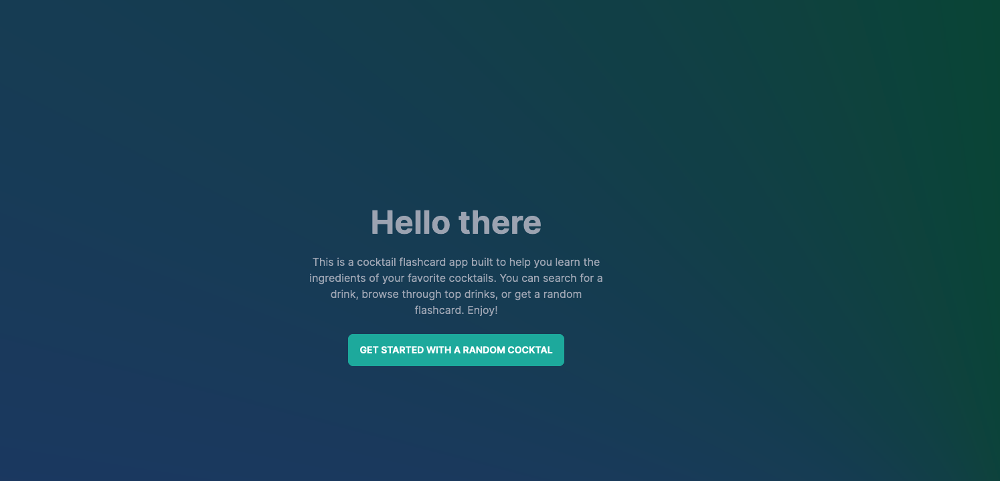
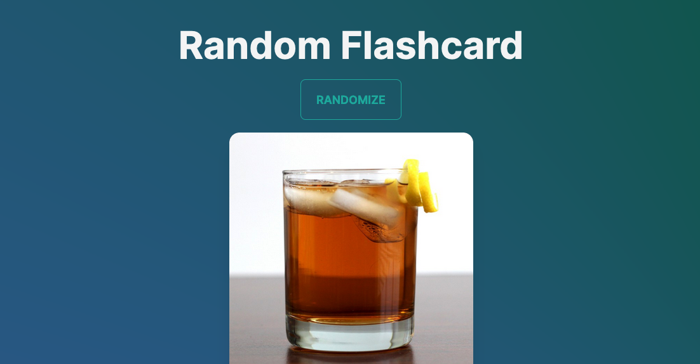

# Cocktail-Flashcards

Flashcards to help better memorize a variety of different cocktails

## Description:

This website is designed to help users quickly and easily look up cocktail recipes. It features a flashcard-style study mode and a browsing mode for users to explore cocktails. Currently, all cocktail data is retrieved from the reliable and comprehensive API provided by The [The Cocktail DB](https://www.thecocktaildb.com/). In the future, the website will have its own database to provide even more accurate and up-to-date information.

## Table of Contents:

- [Installation](#installation)
- [Usage](#usage)
- [License](#license)
- [Contributions](#contributions)
- [Published Page](#page)
- [Repo](#repo)

## Installation

No installation.

## Usage

This site is designed to help users quickly and easily look up cocktail recipes. It features a flashcard-style study mode and a browsing mode for users to explore cocktails. 

The flashcard mode allows users to test their knowledge of cocktails by displaying a cocktail name and asking the user to guess the ingredients.

The browsing and searching mode allows users to search for cocktails by name and view detailed information about each cocktail, including a list of ingredients and instructions for making the cocktail. Overall, the app is a great tool for anyone looking to expand their knowledge of cocktails or improve their bartending skills.

There is also a list of the top 50 cocktails currently sourced from several online locations.

## License

N/A

## Contributions

[Zeus Cordeiro](https://github.com/Zcordeiro/)

All Cocktails currently are comming from this API:
[The Cocktail DB](https://www.thecocktaildb.com/)

## Screen Shot

# LINKS

## Published Page

https://coctail-flashcards.vercel.app/

## Repo

https://github.com/Zcordeiro/Cocktail-Flashcards
